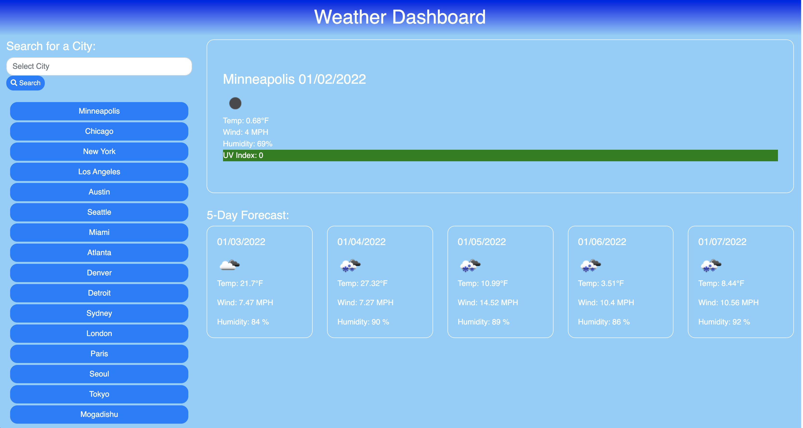

# Weather Dashboard #
Weather Dashboard - Jae Ahn

This is a weather dashboard application that runs in the browser and allows a user to search for cities and retrieve weather data for those city.

At the start of the application, the user is presented with an input field where they can enter a city name.  After typing in a city name, the user can then click the search button below the input field.  After doing so, the application will then present the city name, the date, an icon representation of weather conditions, the temperature (in fahrenheit), the humidity, the wind speed, and the UV index in the jumbotron of the webpage.  The UV index will also present a color that indicates whether the conditions are favorable (green), moderate (yellow), or severe (red).

In addition to presenting the current weather conditions of a searched city, the application will also present the user with a 5-day forecast that displays the date, an icon representation of weather conditions, the temperature, the wind speed, and the humidity.

Lastly, each time that the user searches for a city, that city is added to the search history below the search bar.  The user can click on a city in the search history to be presented with the current and future conditions for that city.

This application was created using many tools such as:
* html
* css
* javascript
* jquery
* moment.js
* font awesome
* bootstrap
* Current Weather Data API (openweathermap.org)
* One Call API (openweathermap.org)

Some of the methods used in creating this application were found fro resources such as W3Schools, MDN Web Docs, and Stack Overflow.

Link to Deployed Application
---------------
[Weather Dashboard](https://ahnjaeyung.github.io/Weather_Dashboard/)
